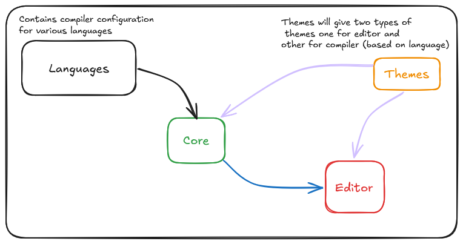

# Editor

This is a project for a code editor component with dynamic styling capabilities.

## Folder Structure

1. `app`: Contains a test application where you can experiment with the code editor component.
2. `packages/editor`: Contains the main code editor component with classes applier and styling logic.
3. `packages/core`: Contains shared utilities and types used across the project.
4. `packages/themes`: Contains themes for the code editor component.
5. `packages/languages`: Contain configuration for compiler of various programming languages. It will be used by core package to provide syntax highlighting and other language-specific features.

